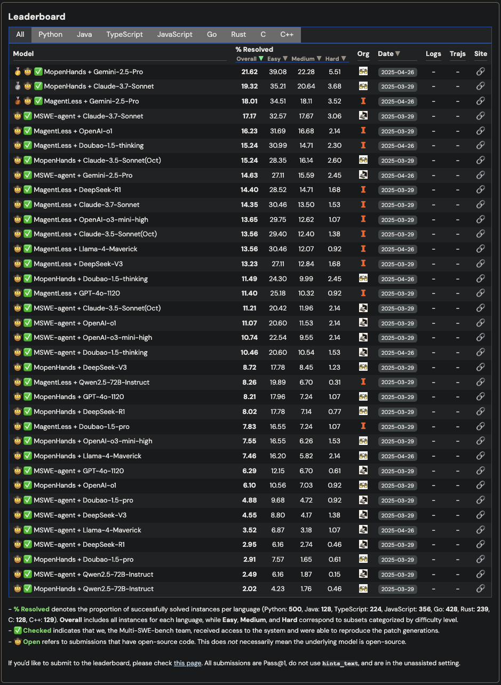
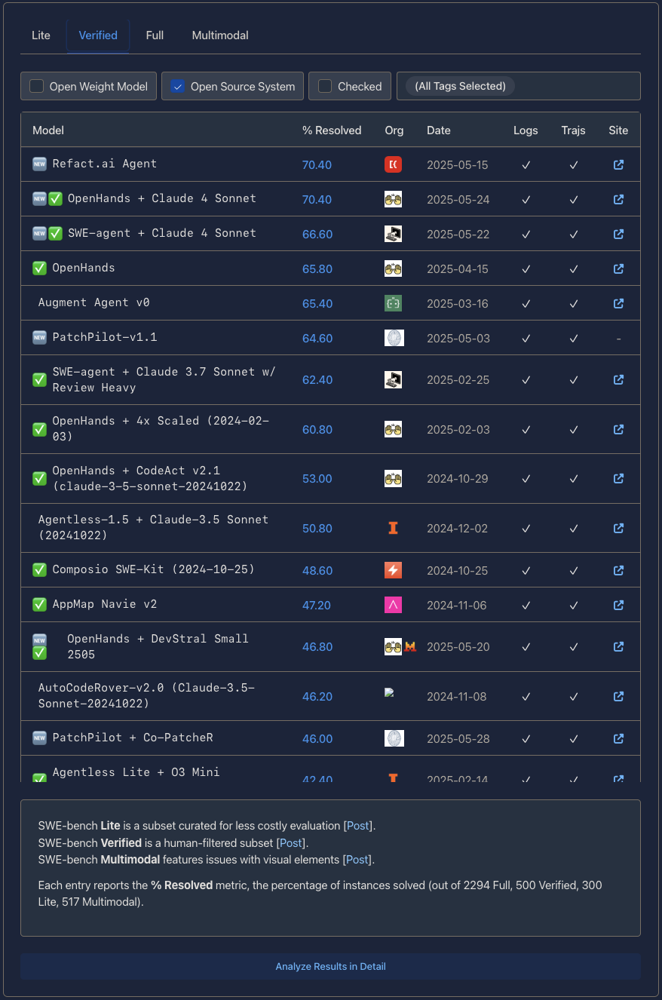
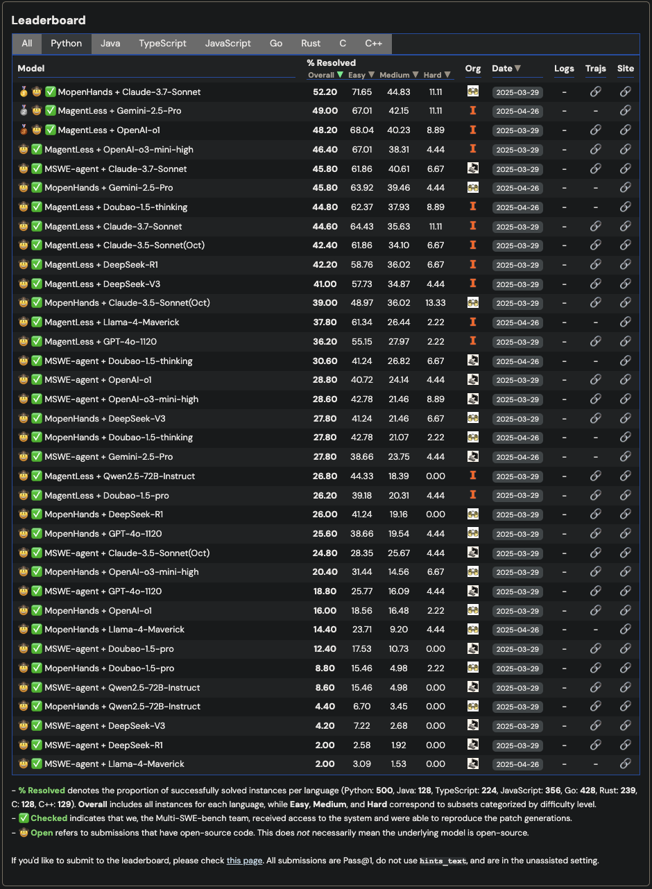
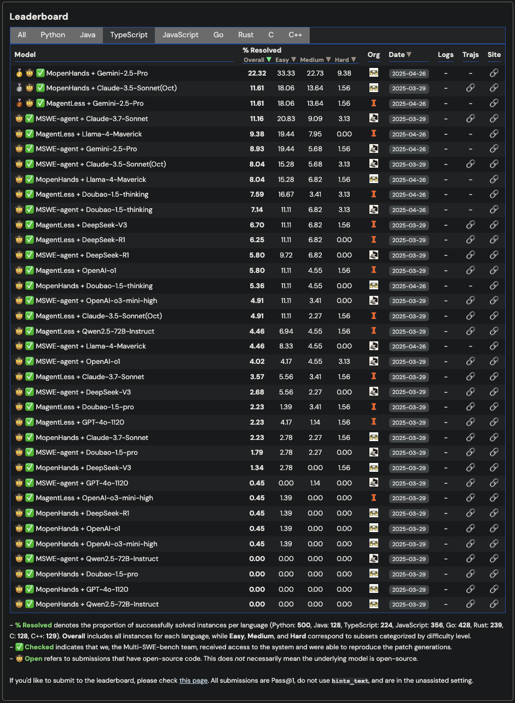

# OHA

🌾 🥳 🌋 🏰 🌅 🌕 [OpenHands](https://github.com/All-Hands-AI/OpenHands) Advanced 🌖 🌔 🌈 🏆 👑

## SWE Bench Leaderboard

### All

[#1](https://multi-swe-bench.github.io/#/)



*MopenHands + Claude-3.7-Sonnet achieves state-of-the-art performance on the SWE-bench leaderboard.*

### SWE Bench Verified

[#2](https://www.swebench.com/)



### Python



### TypeScript



## Configuration

### Environment Setup

1. **Copy the example environment file:**

   ```bash
   cp .env.example .env
   ```

2. **Configure your environment variables in `.env`:**

#### Required Variables

| Variable | Description | Example |
|----------|-------------|---------|
| `LLM_API_KEY` | Your LLM provider API key | `sk-ant-api03-...` |

#### Optional Variables

| Variable | Description | Example |
|----------|-------------|---------|
| `SEARCH_API_KEY` | API key for search functionality (Tavily) | `tvly-***` |

#### LLM Configuration

| Variable | Description | Default | Options |
|----------|-------------|---------|---------|
| `LLM_PROVIDER` | LLM provider to use | `anthropic` | `anthropic`, `openai`, `groq` |
| `LLM_MODEL` | Model to call | `anthropic/claude-sonnet-4-20250514` | Provider-specific model names |
| `LLM_NUM_RETRIES` | How many times to retry a failed completion | `3` | `1-10` |
| `LLM_CACHING_PROMPT` | Enable prompt/result cache | `true` | `true`, `false` |
| `LLM_REASONING_EFFORT` | Agent reasoning effort level | `high` | `low`, `medium`, `high` |

#### Agent Configuration

| Variable | Description | Default | Options |
|----------|-------------|---------|---------|
| `AGENT_MEMORY_ENABLED` | Persist and recall agent memory across runs | `true` | `true`, `false` |
| `AGENT_ENABLE_THINK` | Emit the agent's internal THINK steps to the logs | `true` | `true`, `false` |
| `AGENT_ENABLE_MCP` | Enable multi-component-planning mode | `false` | `true`, `false` |

#### System Configuration

| Variable | Description | Default | Options |
|----------|-------------|---------|---------|
| `SANDBOX_PLATFORM` | Target platform architecture | `linux/amd64` | `linux/amd64`, `linux/arm64` |
| `SANDBOX_ENABLE_GPU` | Enable GPU support in sandbox | `false` | `true`, `false` |
| `SANDBOX_RUNTIME_CONTAINER_IMAGE` | Container image for the runtime sandbox | `all-hands-ai/runtime:latest` | Any valid container image |
| `CONTAINER_NAME` | Name given to the Docker container | `oha-cli-container` | Any valid container name |

#### Logging Configuration

| Variable | Description | Default | Options |
|----------|-------------|---------|---------|
| `LOG_LEVEL` | Logging level for the application | `INFO` | `DEBUG`, `INFO`, `WARNING`, `ERROR`, `CRITICAL` |
| `LOG_ALL_EVENTS` | Log all events or only top-level events | `true` | `true`, `false` |

### Example `.env` Configuration

```bash
# Optional - Search functionality
SEARCH_API_KEY=tvly-***

# Required - LLM API Key
LLM_API_KEY=

# LLM Configuration
LLM_PROVIDER="anthropic"
LLM_MODEL="anthropic/claude-sonnet-4-20250514"
LLM_NUM_RETRIES=3
LLM_CACHING_PROMPT=true
LLM_REASONING_EFFORT="high"

# System Configuration
SANDBOX_PLATFORM="linux/amd64"
SANDBOX_ENABLE_GPU=false
SANDBOX_RUNTIME_CONTAINER_IMAGE="all-hands-ai/runtime:latest"

# Agent Configuration
AGENT_MEMORY_ENABLED=true
AGENT_ENABLE_THINK=true
AGENT_ENABLE_MCP=false

# Container Configuration
CONTAINER_NAME="oha-cli-container"

# Logging Configuration
LOG_LEVEL="INFO"
LOG_ALL_EVENTS=true
```

📖 **For detailed LLM configuration options, visit:** [LLM Configuration Guide](https://docs.all-hands.dev/modules/usage/llms)

## Running the Application

### Make the run script executable

```bash
chmod +x run-open-hands.sh
```

### Run the application

```bash
./run-open-hands.sh
```

The script will:

- Load environment variables from `.env`
- Set up the workspace directory
- Run the Open Hands container with the necessary configurations
- Mount required volumes for workspace and Docker socket
- Connect to the specified LLM provider

## Requirements

- Docker installed and running
- Valid LLM Provider API key
- Proper permissions to access Docker socket

### Prompting Best Practices

Check it out [here](https://docs.all-hands.dev/modules/usage/prompting/prompting-best-practices) to learn how to prompt efficiently.

### Custom repository knowledge base

Create repository-specific Microagents to store the repository knowledge base. Check it out [here](https://docs.all-hands.dev/modules/usage/prompting/microagents-repo)

### Model Context Protocol

[MCP](https://github.com/All-Hands-AI/OpenHands/blob/main/docs/usage/mcp.mdx)

### Search Engine

[Tavily](https://github.com/All-Hands-AI/OpenHands/blob/main/docs/usage/search-engine-setup.mdx)

### Reference docs

Put all development documents to folder `reference_docs` at root repository folder (Markdown format is recommended). Create `index.md` to brief the overview of all document files. You can create each `index.md` file for each sub-folder.
